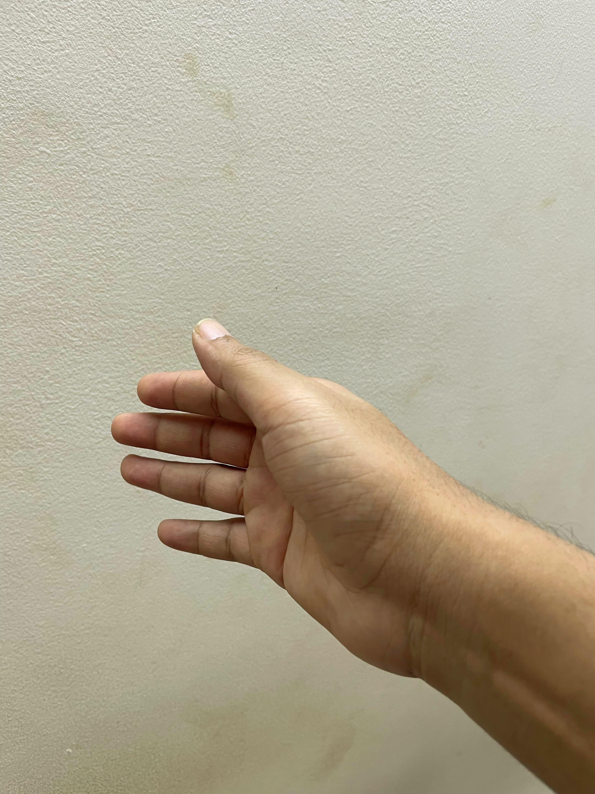
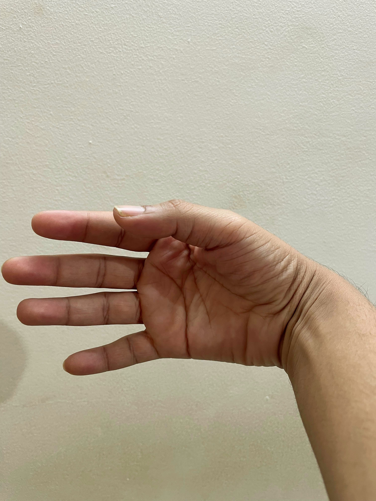
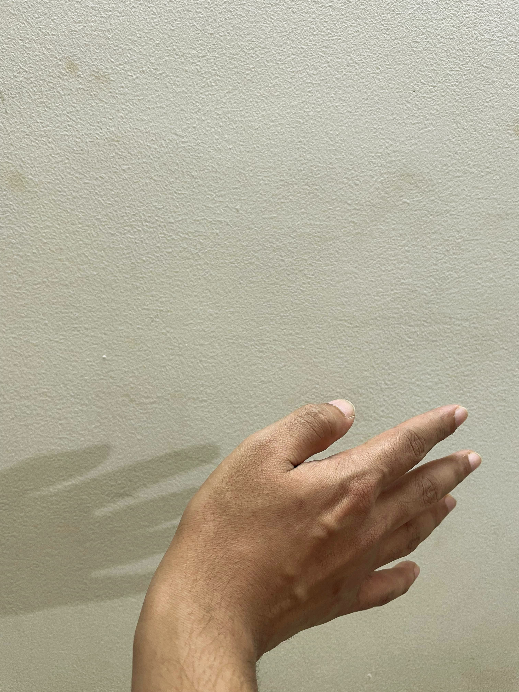
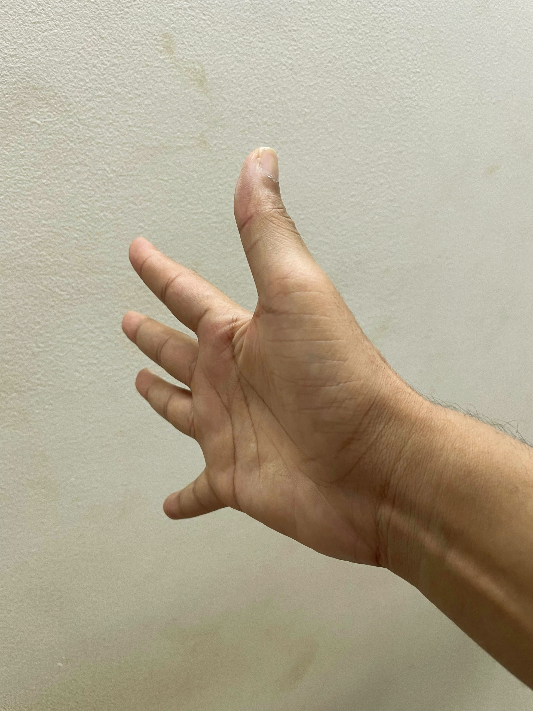
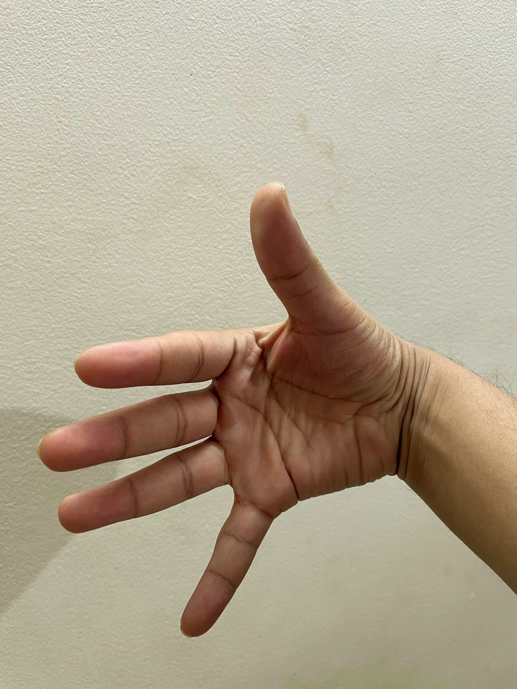
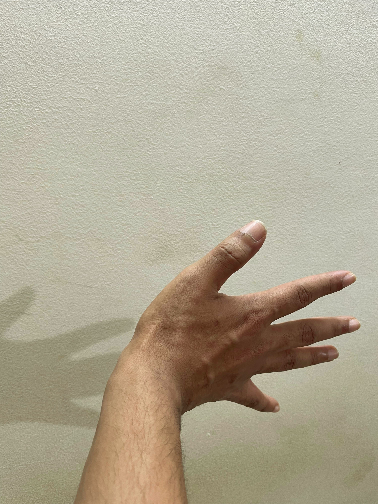
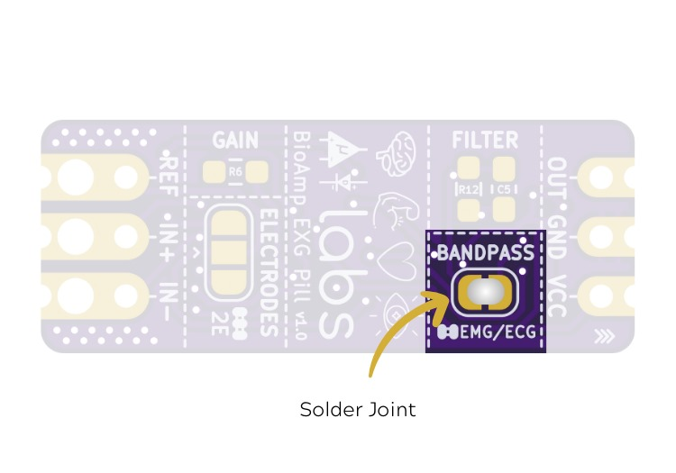

# EMG-Based Game Controller

This project transforms your muscle activity into keyboard keystrokes, enabling gesture-based control for gaming or other applications. By combining Arduino and Python, you can create a custom, gesture-controlled setup. Follow this guide to set up, test, and customize your EMG-based game controller.
It is currently available in two versions: Basic and Advanced. The Basic version is designed to cater to a broad audience with generalized features, while the Advanced version is optimized for better performance but may vary and be less accurate for different users. 
You can also checkout our detailed tutorial on [Instructables](https://www.instructables.com/Controlling-Video-Games-Using-Muscle-Signals-EMG/).

## Gesture Mapping with Photos

| Gesture Description                            | Triggered Action            | Example Photo                          |
|------------------------------------------------|-----------------------------|----------------------------------------|
| No muscle activity detected                    | No keystroke                |   |
| Bend hand to the left                          | Left Arrow Key              |     |
| Bend hand to the right                         | Right Arrow Key             |    |
| Flex fingers                                   | Up Arrow Key                |  |
| Flex fingers + Bend hand to the left (Advanced)| Left + Up Arrow Keys        |     |
| Flex fingers + Bend hand to the right(Advanced)| Right + Up Arrow Keys       |    |

---

## Table of Contents
1. [Setup](#setup)
2. [Uploading the Code](#uploading-the-code)
3. [Testing & Playing](#testing--playing)
4. [Customizing Keystrokes](#customizing-keystrokes)
5. [Tips for Best Results](#tips-for-best-results)

---

## Setup


Before you begin, ensure you have the following:
- **Hardware**: Arduino board, EMG sensor, connecting cables, and electrodes.
- **Software**: 
  - [Arduino IDE](https://www.arduino.cc/en/software)
  - [Python](https://www.python.org/downloads)
  - Necessary Python modules (detailed in the Python script or README in the repository).

<div style="margin-bottom: 20px;">
  <h3>Step 1: Stack Muscle BioAmp Shield on Arduino Uno</h3>
  <p>Stack the Muscle BioAmp Shield securely on the Arduino Uno board.</p>
  
</div>

<div style="margin-bottom: 20px;">
  <h3>Step 2: Configure BioAmp EXG Pill for EMG/ECG (Optional)</h3>
  <p>BioAmp EXG Pill is by default configured for recording EEG or EOG, but for better ECG or EMG quality, it's recommended to configure it by making a solder joint as shown in the image below.</p>
  <p>Note: Even without making the solder joint, BioAmp EXG Pill can record ECG or EMG, but the signals will be more accurate if configured.</p>
  
</div>

<div style="margin-bottom: 20px;">
  <h3>Step 3: Connecting BioAmp EXG Pill</h3>
  <p>Connect the BioAmp EXG Pill to the A2 port of Muscle BioAmp Shield via a 3-pin STEMMA cable with a JST PH 2.0mm connector on one end and 3 female jumpers on the other.</p>
  
</div>

<div style="margin-bottom: 20px;">
  <h3>Step 4: Connecting Electrode Cables</h3>
  <p>Connect one BioAmp cable to BioAmp EXG Pill and another to Muscle BioAmp Shield by inserting the cable ends into the respective JST PH connectors, as shown below.</p>
  
</div>

<div style="margin-bottom: 20px;">
  <h3>Step 5: Skin Preparation</h3>
  <p>We’ll create a 2-channel EMG acquisition system to record EMG signals from the finger extensor muscle and the brachioradialis muscle, Thus, prepare the skin accordingly.</p>
  <p>Apply Nuprep Skin Preparation Gel on the skin surface where electrodes would be placed to remove dead skin cells and clean the skin from dirt. After rubbing the skin surface thoroughly, clean it with an alcohol wipe or a wet wipe.</p>
  
</div>

<div style="margin-bottom: 20px;">
  <h3>Step 6: Electrode Placements</h3>
  <p>Snap the BioAmp Cable connected to the BioAmp EXG Pill to gel electrodes. Peel the plastic backing from the electrodes.</p>
  <p>Place the IN+ and IN- cables on the finger extensor muscle & REF (reference) at the back of your elbow bone as shown below.</p>
  
  <p>Now snap the BioAmp Cable connected to Muscle BioAmp Shield to gel electrodes. Peel the plastic backing from electrodes.</p>
  <p>Place the IN+ and IN- cables on the brachioradialis muscle & REF (reference) at the bony part near your elbow as shown below.</p>
  
  <p>Just make sure to place the IN+, IN- electrodes on the targeted muscle and REF on a bony part.</p>
</div>

---

## Uploading the Code

1. **Connect Your Arduino**:
   - Use a USB cable to connect the Arduino to your laptop.

2. **Download the Code**:
   - Visit the [GitHub repository](#) and download the provided files.
   - Open the `12_2CH_EMG_Game_Controller.ino` file in Arduino IDE.

3. **Configure Arduino IDE**:
   - Select the correct **COM port** and **board**(which says the name of the device such as Arduino UNO R3) under the **Tools** menu. 

4. **Upload the Code**:
   - Click the **Upload** button. A progress bar will indicate the upload status.

5. **Optimize Signal Quality**:
   - Sit at least 5 meters away from AC appliances or electronic devices to avoid interference.
   - Unplug your laptop charger to reduce electrical noise.

6. **Calibrate signal values**
   - Uncomment #define Calibrate on line 71 to print signal values from each channel on the serial monitor.
   - Use these values to test and update the threshold values for each channel on line 76.
---

## Switching to Advanced version

   **Uncomment #define Advanced on line 74 to switch to Advanced version and upload the code.**

## Testing & Playing

1. **Select the correct Test with the Serial Monitor**:
   - Open the Serial Monitor in Arduino IDE.
   - Ensure the correct baud rate (e.g., 115200) is selected in the code and matches the Serial Monitor settings.
   - Observe real-time outputs:
     - `0`: No muscle activity detected, no keystroke triggered.
     - `1`: Bend your hand to the left, triggering the **Left Arrow** key.
     - `2`: Bend your hand to the right, triggering the **Right Arrow** key.
     - `3`: Flex your fingers, triggering the **Up Arrow** key.
     - `4`: Flex your fingers while bending your hand to the left, triggering the **Left Arrow** key and **Up Arrow** key. (Advanced)
     - `5`: Flex your fingers while bending your hand to the right, triggering the **Right Arrow** key and **Up Arrow** key. (Advanced)

2. **Run the Python Script**:
   - Open the `12_2CH_EMG_Game_Controller.py` script in [Visual Studio Code](https://code.visualstudio.com/) or any Python IDE.
   - Ensure all required Python modules are installed by running the following command:
      ```python
     pip install -r requirements.txt
     ```
   - Run the script using the command:
     ```python
     python 12_2CH_EMG_Game_Controller.py
     ```
   - It will automatically detect your Arduino's COM port.
   - If the port isn’t detected, manually edit the COM port in the script:
     ```python
     ser = serial.Serial("COM_PORT_HERE", 115200)
     ```

3. **Observe Keystroke Mapping**:
   - The terminal will display mapped keystrokes based on your gestures.

---

## Customizing Keystrokes

1. Open the `12_2CH_EMG_Game_Controller.py` script in a text editor.
2. Locate lines like:
   ```python
   keyboard.press('left')
   ```
3. Replace `'left'`, `'right'`, or `'up'` with your desired keys. For example:
   - Replace `'left'` with `'A'` for racing games.
   - Replace `'right'` with `'D'` for movement in RPGs.

4. Save your changes and rerun the script.

---

## Tips for Best Results

- **Positioning**: Ensure the EMG sensors are securely attached to your muscles.
- **Avoid Interference**: Keep a distance from electronics or AC devices.
- **Adjust Settings**: Modify thresholds or keystroke timings in the code to suit your muscle activity and gameplay.

---

This Game Controller transforms your muscle movements into gaming actions, enhancing both accessibility and interactivity. Customize it for various games and enjoy your new EMG-based game controller!
