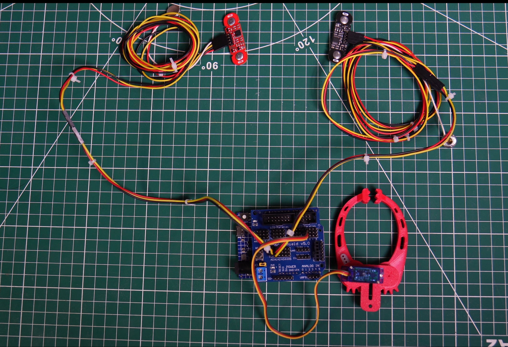

# BioArm Wrestling – Arm Wrestle with Your Muscles

Turn real muscle activity into a head-to-head arm wrestling match! This project uses **Electromyography (EMG)** signals from two players' forearms to move a physical servo needle, a virtual browser meter, or both together. Whoever flexes harder wins the round.

---

## Table of Contents

- [How It Works](#how-it-works)
- [Features](#features)
- [Hardware Required](#hardware-required)
- [Software Required](#software-required)
- [Hardware Setup](#hardware-setup)
- [Skin Preparation & Electrode Placement](#skin-preparation--electrode-placement)
- [Uploading the Code](#uploading-the-code)
- [Launching the Web App](#launching-the-web-app)
- [Playing a Match](#playing-a-match)
- [Troubleshooting](#troubleshooting)

---

## How It Works

BioArm Wrestling is a fun two-player game where both players compete using their muscle activity. Each player is connected to a BioAmp sensor, which detects the muscle signals produced while flexing their forearm.

Both players have the same goal: **flex stronger than the other player and move the needle toward their side**.

- **Player 1 (Channel 1):** Moves the needle toward their side.
- **Player 2 (Channel 2):** Moves the needle toward their side.

The needle starts in the middle. As both players flex, it moves toward the player producing the stronger muscle signal. The first player to move the needle completely to their endpoint wins the round.

Throughout the match, a live web interface displays both players' muscle activity and the overall match progress, making it easy for players and spectators to follow the action in real time.

---

## Features

- **Real-time EMG visualization** waveform traces for both players
- **Physical and virtual strength meters** that show the needle position in real time
- **Flexible play modes:** web interface only, physical servo only, or both together
- **3-second countdown** before every round, so both players start fair and ready
- **Automatic reconnect** if the USB cable is pulled mid-match. The website detects it, resets cleanly, and reconnects the moment the board is plugged back in
- **Editable player names**, rematch and new-opponent flows, and a clean winner overlay

---

## Hardware Required

Choose either of these two-channel EMG setups:

- **2× BioAmp EXG Pill** (one per player) with BioAmp cables. Two EXG Pills are also available together in the **BioAmp EXG Explorer Pack**.
- **OR 2× Muscle BioAmp Patchy units** (one per player), used with an **Arduino Shield** or wired directly using a breadboard and jumper wires.

Other required items:

- Arduino Uno R4 Minima
- 1× Servo motor with a 3D-printed meter and needle attached (optional when using only the web interface)
- Gel electrodes (3 per channel: positive, negative, reference)
- Alcohol swab / wet wipes
- USB cable (for Arduino)
- Breadboard and male-to-male jumper wires (for setup without a shield)

> 🛒 Available from the [Upside Down Labs Store](https://store.upsidedownlabs.tech/) and other UDL resellers (Amazon, Robu, Tindie, DigiKey).

## Software Required

- [Arduino IDE](https://www.arduino.cc/en/software)
- Arduino UNO R4 board package:
  `Tools → Board → Boards Manager → Search "Arduino UNO R4 Boards" → Install`
- A computer with a Chromium-based browser such as Chrome, Brave, or Edge (for the web interface)

---

## Hardware Setup

  

### Step 1: Connect the BioAmp sensors

You can use either two BioAmp EXG Pills or two Muscle BioAmp Patchy units.

For a direct breadboard setup:

- Connect the Arduino's **5V** and **GND** pins to the breadboard power rails.
- Connect both sensors' **VCC** pins to the **5V rail**.
- Connect both sensors' **GND** pins to the **GND rail**.
- Connect **Player 1's OUT** pin to Arduino **A0 (Channel 1)**.
- Connect **Player 2's OUT** pin to Arduino **A1 (Channel 2)**.

If using an Arduino Shield, mount it correctly and connect the sensors according to the labels on the shield. Make sure the two outputs reach **A0** and **A1**, or update `CHANNEL_1` and `CHANNEL_2` in the sketch to match the pins used.

Connect one electrode cable to each sensor and double-check VCC and GND before powering the circuit.

### Step 2: Connect the servo motor (optional)

Connect the servo wires as follows:

- **Yellow signal/output wire** → Arduino **D2**
- **Red VCC wire** → suitable servo power supply
- **Black or brown GND wire** → **GND**

> Servo wire colors can vary, so check your servo's datasheet if its colors are different.

### Step 3: Center and attach the needle

Connect the Arduino UNO R4 Minima to your computer using a USB cable. This powers the board and provides the serial connection used by the web interface to communicate with the game.

Before screwing the needle onto the meter:

1. [Upload the firmware](#uploading-the-code) to the UNO R4 Minima.
2. Connect the servo to the board and press the Arduino's reset button.
3. The servo will move to its **90° center position**.
4. Place the needle in the middle of the printed meter, then screw it onto the servo horn.

The horn teeth may make the needle sit slightly left or right of the exact center. A small offset is normal, but it can make the two end positions unequal. If needed, adjust the servo limits in the sketch and upload it again:

- Needle sits slightly toward the **left**: reduce `SERVO_MAX` and `SERVO_START` by about 10 degrees.
- Needle sits slightly toward the **right**: increase `SERVO_MIN` and `SERVO_START` by about 10 degrees.

Use these values as a starting point and fine-tune them until both sides have nearly equal travel.

---

## Skin Preparation & Electrode Placement

This is a **2-channel system**:
- **Channel 1** → **Player 1**'s forearm
- **Channel 2** → **Player 2**'s forearm

### Skin Prep
Clean the skin with an alcohol swab to remove oils and dead skin cells. Allow it to dry completely before applying the electrodes to ensure good electrical contact.
Refer [this guide](https://docs.upsidedownlabs.tech/guides/usage-guides/skin-preparation/index.html) for proper skin preparation.

### Electrode Placement

For each player, connect three gel electrodes. Place the sensing electrodes over the forearm muscle being flexed, and place the reference electrode on the bony region near the elbow. Refer to the [BioAmp EXG Pill documentation](https://docs.upsidedownlabs.tech/hardware/bioamp/bioamp-exg-pill/index.html#measuring-electromyography-emg) or [Muscle BioAmp Patchy documentation](https://docs.upsidedownlabs.tech/hardware/bioamp/muscle-bioamp-patchy/index.html#step-4-electrode-placements) for the selected sensor.

Good skin contact is the single biggest factor in clean EMG signal, spend the extra minute here.

> **Fair-play note:** Keep the muscle location, electrode spacing, electrode direction, and skin preparation as similar as possible for both players. This helps make the comparison fair.

---

## Uploading the Code

1. On the home page of this repository, click the green **`<> Code`** button.
2. From the dropdown menu, select **`Download ZIP`** to download the repository as a ZIP file.
3. Extract the downloaded ZIP file to any location on your computer.
4. Open the extracted repository folder.
5. Navigate to the `14_2CH_EMG_BioArm_Wrestling` folder.
6. Open the `14_2CH_EMG_BioArm_Wrestling.ino` sketch in the Arduino IDE.
7. Connect your Arduino board to your computer using a USB cable.
8. In the Arduino IDE, select your board from **`Tools → Board → Arduino UNO R4 Minima`**.
9. Select the correct serial port from **`Tools → Port`**. If the port is not listed, disconnect and reconnect the board, then check again.
10. Click **Upload** and wait for the upload to complete.

> **Important:** For best signal quality, **unplug your laptop charger** and sit **at least 5 meters away from AC appliances** while playing. This minimizes electrical interference (50/60 Hz noise) on the EMG signal.

---

## Launching the Web App

1. Open the extracted repository folder and navigate to the `14_2CH_EMG_BioArm_Wrestling` folder.
2. Open the `index.html` file in a desktop browser that supports Web Serial (Google Chrome or Microsoft Edge).
3. Click **Connect to Arduino** and select the correct serial port.
4. Once connected, the status indicator will turn green, and the application will be ready to start a match.

> Web Serial requires a secure context or a local file, and does not work on mobile browsers.

---

## Playing a Match

Choose any of these play modes:

- **Web interface only:** Leave the physical servo disconnected and use the virtual strength meter in the browser.
- **Servo only:** Play using the physical meter without opening the web interface.
- **Both:** Connect the servo and web interface together to use both meters at the same time.

### Using the web interface

1. Click **Connect to Arduino** and select the correct serial port
2. Enter both player names
3. Click **Start Duel**, a 3-second countdown begins
4. Flex your forearm muscles stronger than your opponent to move the needle toward your side. The waveform traces and strength meter update in real time.
5. The first player to move the needle completely to their endpoint wins the round
6. Hit **Rematch** to go again, or **New Opponents** to reset names and start fresh

### Using only the physical servo

Power or reset the Arduino without opening Serial or the web interface. The game starts automatically after 2 seconds. Press the Arduino's reset button to play another round.

---

## Troubleshooting

| Issue | Possible Fix |
|---|---|
| Web app won't connect | Confirm you're using Chrome or Edge on desktop; check the correct serial port is selected |
| No `READY` message on Serial Monitor | Re-upload the firmware; check the board selection under `Tools → Board`. Unplug and plug the board once and check if any other application is using the serial port |
| Noisy / inconsistent EMG readings | Re-do skin prep; check electrode placement and contact; sit away from AC appliances and chargers. See the [UDL troubleshooting guide](https://docs.upsidedownlabs.tech/guides/troubleshoot/tips/index.html) for more tips |
| USB unplugged mid-match | The app auto-detects this, resets the UI, and reconnects automatically once the board is plugged back in |
| Web Serial not supported | Use Chrome or Edge on desktop or check whether your browser supports web serial interface |
